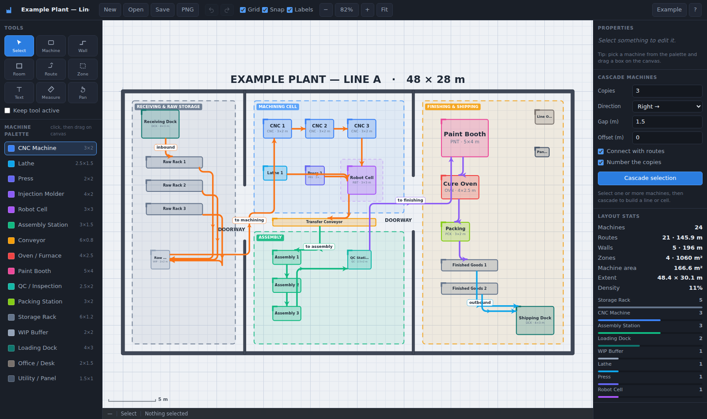
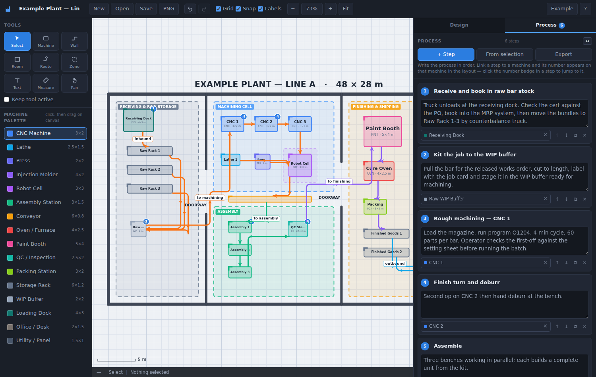
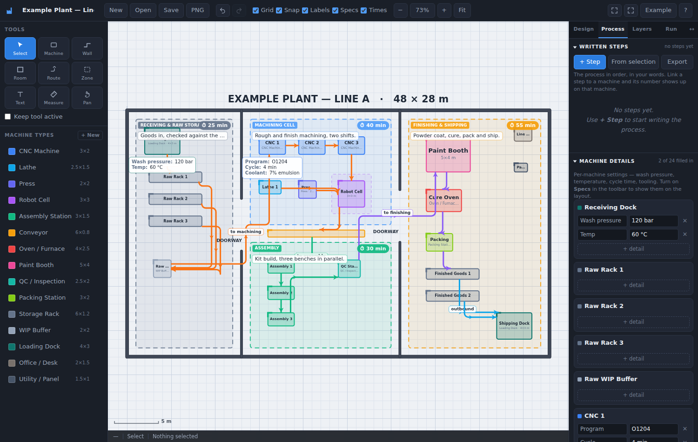
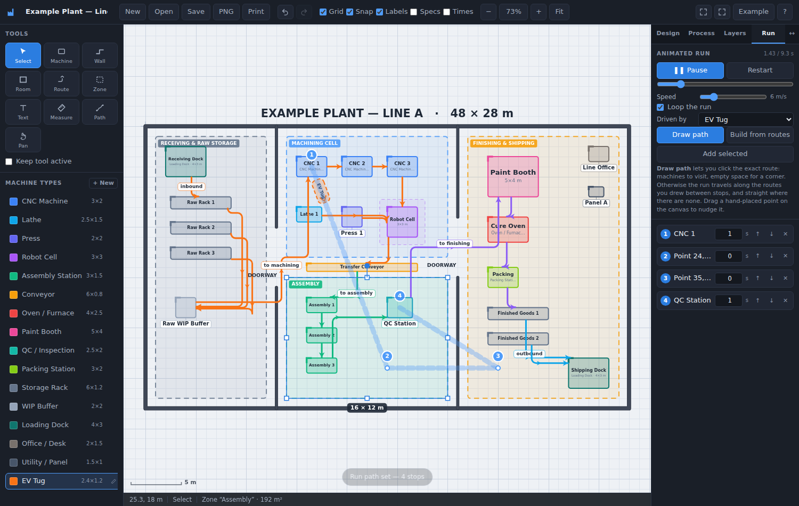
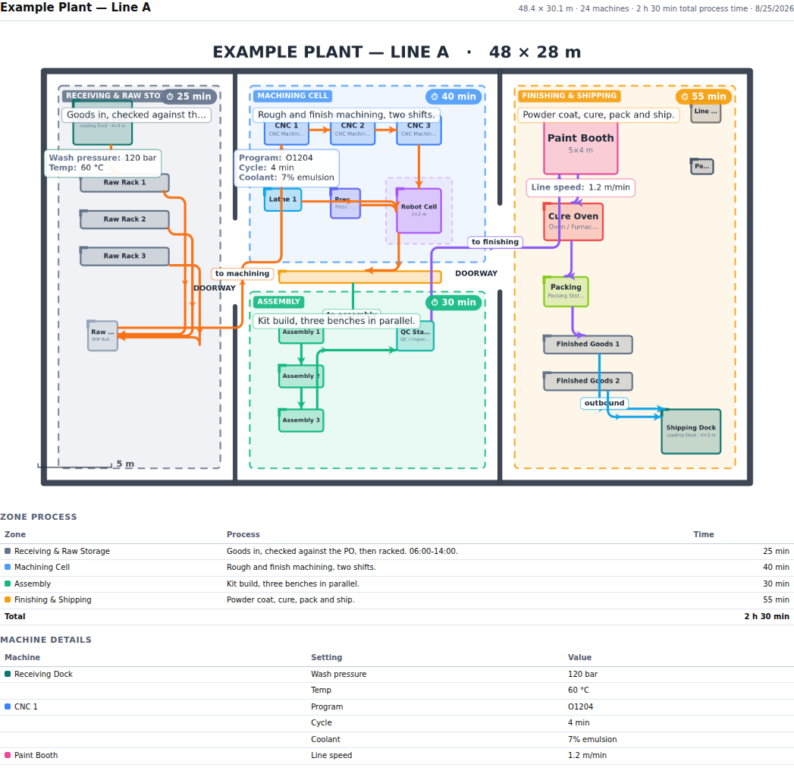

# Factory Layout Builder

A browser-based tool for drawing factory floor layouts: drag out machines, wire
them together with material-flow routes, cascade a machine into a whole line,
and enclose it all with walls and zones.

No build step, no dependencies, no server. Grab the single-file build
`factory-layout-builder.html` and double-click it, or open `index.html` from a
full checkout.



## Running it

**One file, nothing else needed** — download `factory-layout-builder.html` and
double-click it. Everything (styles, scripts, the example plant) is inlined.

**From the repo** — `index.html` loads `css/` and `js/` from alongside it, so
keep the whole folder together:

```
git clone https://github.com/kimmikimmix/Detail-Builder.git
cd Detail-Builder
git checkout claude/factory-layout-builder-1kqv53
open index.html          # macOS — or just double-click the file
```

> Saving `index.html` on its own (right-click → Save as, or downloading the
> single file from GitHub) gives you an unstyled page of plain text and
> buttons: the browser can't find `css/style.css` or the `js/` files. Use the
> standalone file above, or keep the folder intact.

Any static server works too, e.g. `npx http-server -p 8080 .`

After editing anything under `css/` or `js/`, regenerate the standalone file:

```
node tools/build-standalone.js
```

## What you can draw

| Item | How |
| --- | --- |
| **Machine** | Pick one of your machine types, then drag a box on the canvas — or click once for that type's default size, or drag the palette entry straight onto the canvas. With no type selected you get a plain box to name yourself. |
| **Route** | A one-way arrow from A to B: drag from one machine to another, or click the source then the target. Click empty space mid-route to add a bend. Ends anywhere — on a machine, or in open space via double-click, <kbd>Enter</kbd> or right-click. Routes stay attached when you move the machines. |
| **Wall** | Click each corner and press <kbd>Enter</kbd> (or double-click) to finish. Drag for a single straight run. Hold <kbd>Shift</kbd> to lock to 45°. |
| **Room** | Drag a rectangle to get four walls at once. |
| **Zone** | Drag out a named area (machining cell, warehouse, assembly). Zones sit behind everything and only catch clicks on their border or title, so machines inside stay grabbable. |
| **Text** | Click to drop an annotation. |
| **Measure** | Drag to read a distance, plus its Δx / Δy. |

### Your own machine types

There is no built-in catalogue — **the palette starts empty and you fill it
with the machines you actually have.**

- **+ New** defines a type: a name, a default footprint in metres, and a
  colour. It then sits in the palette ready to place.
- The **pencil** on a palette row edits or deletes a type. Editing only changes
  what you place next, unless you tick *apply to the N machines already using
  this type* — so a machine you deliberately resized stays as you left it.
- Deleting a type leaves its machines exactly as they are; they simply stop
  being typed.
- Drew a box first? Select it and hit **Save as…** next to Type in the
  Properties panel to turn it into a reusable type.
- Types are stored **inside the layout file**, so a layout always travels with
  the machines it was drawn with. Starting a **New** layout carries your types
  over, so your library survives.
- Opening a file written before types existed rebuilds a palette from the
  machines in it, so nothing is lost.

Any machine can then be resized, rotated and recoloured on its own, and given a
clearance halo for the space it needs around it.

### Naming machines

Three ways, whichever suits:

- **Double-click** the machine on the canvas and type — or select it and press
  <kbd>Enter</kbd> or <kbd>F2</kbd>. Same for zones and text labels.
- Select it and edit **Name** at the top of the Properties panel.
- Select a whole run and use **Name all** — typing `Press` names them
  `Press 1`, `Press 2`, `Press 3`… ordered left to right, top to bottom.

### Writing the process

The right-hand panel has two tabs: **Design** (properties, cascade, stats) and
**Process**. The Process tab is a step-by-step write-up of how the plant
actually runs — you write it, in your own words, in whatever detail you want.

- **+ Step** appends a step; each has a title and a details box that takes as
  much text as you care to write (cycle times, tooling, who does it, checks).
- **From selection** adds a step already linked to the selected machine.
- A step linked to a machine puts its **number on that machine** in the layout,
  so the drawing and the write-up stay tied together. Click the number in a
  step to jump straight to that machine; the ✕ on the chip unlinks it.
- Reorder with ↑ ↓, copy with ⧉, delete with ✕, and use **↔** in the panel
  header to widen the sidebar when you are writing at length.
- Steps are saved inside the layout file, and **Export** writes them out as a
  Markdown document you can hand to someone else.





### Machine details and zone process

The **Process** tab holds three sections that fold open and shut independently:

- **Written steps** — the process in your own words (see above).
- **Machine details** — per-machine settings: wash pressure, temperature, cycle
  time, tooling, whatever the machine needs. Any number of rows per machine.
- **Zone process** — what each zone does and when, plus **how many minutes it
  takes**. The section header totals the time across every zone.

Two toolbar switches put that information on the drawing itself: **Specs**
tucks each machine's details under its box, and **Times** puts a cycle-time
badge and the process line on each zone.

### The animated run



The **Run** tab walks a part through the plant so you can watch the flow.

- **Draw path** (<kbd>G</kbd>) lets you click the exact route yourself: click a
  machine to visit it, click empty space for a corner. <kbd>Enter</kbd>,
  double-click or right-click finishes. Hand-placed points can then be dragged
  on the canvas while the Run tab is open.
- **Build from routes** instead follows your arrows from the first machine with
  no inbound route and proposes the whole order; **Add selected** appends a
  machine.
- **Edit the run freely** — reorder stops with ↑ ↓, drop one with ✕, and set the
  seconds of work at each stop. Between stops the token follows the route you
  drew; where there is no route it takes a straight line (drawn dashed).
- <kbd>P</kbd> or the Play button runs it, the scrubber moves through it, and
  **Speed** is travel speed in metres per second. The run is saved with the
  layout.

### Vehicles

Tick **vehicle** on a machine type — or on a single machine in Properties — and
it becomes an EV, AGV, tug or forklift: drawn with a dashed outline and a nose
chevron rather than the fixed-plant corner tick.

Pick one under **Driven by** in the Run tab and that vehicle rides the path
instead of a plain marker, turning to face the way it travels. It stays parked
where you placed it until you press play, and **Restart** brings it home — the
animation never moves it in the document, so nothing is disturbed.

### Layers, locking and hiding

The **Layers** tab lists everything top-of-stack first.

- Click a row to select it; ↑ ↓ change what draws over what.
- The **padlock** stops an item being selected or dragged — the usual fix once
  walls and zones are where you want them and you're working on machines.
- The **eye** takes an item off the canvas entirely; **Show all** brings the
  hidden ones back.

### Printing



**Print** (or <kbd>Ctrl</kbd>+<kbd>P</kbd>) puts the drawing on paper on its own —
none of the toolbars or side panels come with it.

The dialog has its own switches, independent of what happens to be showing on
screen: **Machine details**, **Zone process & times**, **Names**, **Grid**, and
**Summary tables** — a second page listing every zone with its process and time
(with a total) and every machine's settings.

Paper is **A4, A3, Letter or Ledger**, landscape or portrait — a bigger sheet
means a bigger scale, so more of each name fits inside its box.

The drawing is composed at the size it will physically occupy on the page, so
labels, time badges and detail cards print at the same readable size whatever
the plant measures, and the bitmap is supersampled to roughly 290 dpi. The
preview in the dialog is the same composition shown small, so what you see is
what prints; the note under it gives the drawing scale (e.g. `1:182`). Choose
"Save as PDF" in the browser's print dialog for a file.

### Names that don't fit

A machine too small to hold its name no longer gets a truncated one (`Pa…`).
The name goes in a chip just outside the box instead, with a short leader —
above it when a details card is already sitting underneath. Two rules keep that
from becoming clutter: a box under about 26 pixels across is left unnamed, and
a chip that would land on one already placed is dropped rather than drawn over
it. So zoomed out you get the names that fit, and on paper — where the scale is
fixed to the sheet — you get all of them.

### Room to work

<kbd>\\</kbd> or the ⛶ button is **focus mode**: both side panels get out of
the way and the canvas fills the window, keeping whatever was in the middle of
the view in the middle. A second button asks the browser for real full screen,
and **↔** beside the tabs widens the right-hand panel for writing.

### Cascading

Select one or more machines, then use the **Cascade** panel: choose a copy
count, a direction, the gap between copies and an optional perpendicular
stagger. Tick *Connect with routes* and the copies come out already wired in
sequence; tick *Number the copies* and they are named `CNC 1`, `CNC 2`, … It is
the fastest way to lay down a production line or a bank of identical cells.

**Chain routes** (shown when several machines are selected) does the same
wiring for machines you placed by hand, in left-to-right order.

### Everything is in metres

The grid is 1 m with a heavier line every 5 m, and there is a scale bar in the
corner. Sizes, route lengths, wall runs, zone areas and floor density are all
reported in the Layout stats panel as you build.

## Keyboard

| | |
| --- | --- |
| <kbd>V</kbd> <kbd>M</kbd> <kbd>W</kbd> <kbd>R</kbd> <kbd>E</kbd> <kbd>Z</kbd> <kbd>T</kbd> <kbd>K</kbd> <kbd>G</kbd> <kbd>H</kbd> | Select, Machine, Wall, Room, routE, Zone, Text, measure (K), run-path (G), Hand/pan |
| <kbd>Ctrl</kbd>+<kbd>Z</kbd> / <kbd>Ctrl</kbd>+<kbd>Shift</kbd>+<kbd>Z</kbd> | Undo / redo |
| <kbd>Ctrl</kbd>+<kbd>C</kbd> / <kbd>V</kbd> / <kbd>D</kbd> / <kbd>A</kbd> | Copy, paste (at the cursor), duplicate, select all |
| <kbd>Delete</kbd> | Delete the selection — routes attached to a deleted machine go with it |
| <kbd>Enter</kbd> | Finish a wall or route · rename the selected item |
| <kbd>Esc</kbd> | Cancel the current drawing, or clear the selection |
| Arrows | Nudge by ⅕ grid, or a full grid step with <kbd>Shift</kbd> |
| <kbd>[</kbd> / <kbd>]</kbd> | Send backward / bring forward |
| <kbd>F</kbd> | Zoom to fit |
| <kbd>P</kbd> | Play / pause the animated run |
| <kbd>Ctrl</kbd>+<kbd>P</kbd> | Print the drawing |
| <kbd>\\</kbd> | Focus mode — hide both side panels |
| <kbd>Shift</kbd>+click | Add to / remove from the selection |
| <kbd>Alt</kbd>+drag | Ignore grid snapping for this drag |
| <kbd>Space</kbd>+drag, or middle-drag | Pan · scroll wheel zooms at the cursor |

Double-click a machine, zone or label to rename it in place. Double-click a
route or a wall to add a bend or a corner where you clicked.

## Saving

The layout autosaves to `localStorage`, so a reload picks up where you left
off. **Save** downloads a portable `*.factory.json`, **Open** reads one back,
and **PNG** exports the whole floor as an image. **Example** loads a worked
48 × 28 m plant if you want something to poke at.

## Project layout

```
index.html                     markup and panel scaffolding
factory-layout-builder.html    generated single-file build (do not edit)
tools/build-standalone.js      inlines everything into that file
css/style.css                  all styling
js/geometry.js                 vector maths — rotation, hit tests, polylines
js/model.js                    the document: item factories, route paths, (de)serialisation
js/history.js                  snapshot undo/redo
js/render.js                   canvas drawing and PNG export
js/tools.js                    pointer interaction for every tool
js/sample.js                   the example plant
js/ui.js                       palette, properties panel, stats
js/app.js                      state, actions, keyboard, persistence, bootstrap
```

Plain ES5-compatible scripts sharing a `window.FB` namespace — deliberately no
modules, so the page works straight off the filesystem.

## File format

A layout is a JSON document of positioned items:

```json
{
  "version": 1,
  "name": "Example Plant — Line A",
  "grid": 1,
  "types": [
    { "id": "t1", "name": "CNC Machine", "w": 3, "h": 2, "color": "#3b82f6" }
  ],
  "items": [
    { "id": "i1", "type": "machine", "kind": "t1", "x": 15, "y": 3,
      "w": 3, "h": 2, "rot": 0, "label": "CNC 1", "color": "#3b82f6" },
    { "id": "i2", "type": "wall", "points": [{"x":0,"y":0},{"x":48,"y":0}],
      "thickness": 0.35, "closed": false },
    { "id": "i3", "type": "route", "from": {"item":"i1"}, "to": {"x":20,"y":9},
      "waypoints": [], "mode": "ortho", "arrows": "end" }
  ]
}
```

A machine's `kind` is the id of one of the document's own `types`, or `null`
for an untyped box; either way the machine carries its own size, colour and
label, so it draws correctly even if the type is gone.

Route endpoints are either `{"item": "<id>"}` — docked to a machine and
recalculated whenever it moves — or a fixed `{"x": …, "y": …}` point. Unknown
or malformed items are dropped on load rather than breaking the file.

The written process rides along in the same file:

```json
{
  "process": [
    { "id": "s1", "title": "Rough machining — CNC 1",
      "details": "Load the magazine, run program O1204. 4 min cycle…",
      "link": "i1" }
  ]
}
```

A run stop is either `{ "item": "<id>" }` for somewhere on the layout or
`{ "x": …, "y": … }` for a point on a hand-drawn path; `driver` is the id of the
machine marked `"vehicle": true` that rides it.

`link` is the id of the item the step happens at, or `null`. Links pointing at
items that no longer exist are dropped on load.

Machines carry their settings, zones carry their process and cycle time, every
item can be locked or hidden, and the animated run is stored alongside:

```json
{
  "items": [
    { "id": "i1", "type": "machine", "label": "Washer",
      "params": [{ "k": "Wash pressure", "v": "120 bar" },
                 { "k": "Temp", "v": "60 °C" }],
      "locked": false, "hidden": false },
    { "id": "z1", "type": "zone", "label": "Machining Cell",
      "process": "Rough and finish machining, two shifts.", "duration": 40 }
  ],
  "animation": {
    "stops": [{ "item": "i1", "dwell": 1 },
              { "x": 20, "y": 12, "dwell": 0 }],
    "speed": 6,
    "loop": true,
    "driver": "i9"
  }
}
```

**Older files load unchanged.** Every one of these fields is optional: a layout
saved by an earlier version comes back with empty details, no locks, and no run
— nothing is lost and nothing needs converting.
